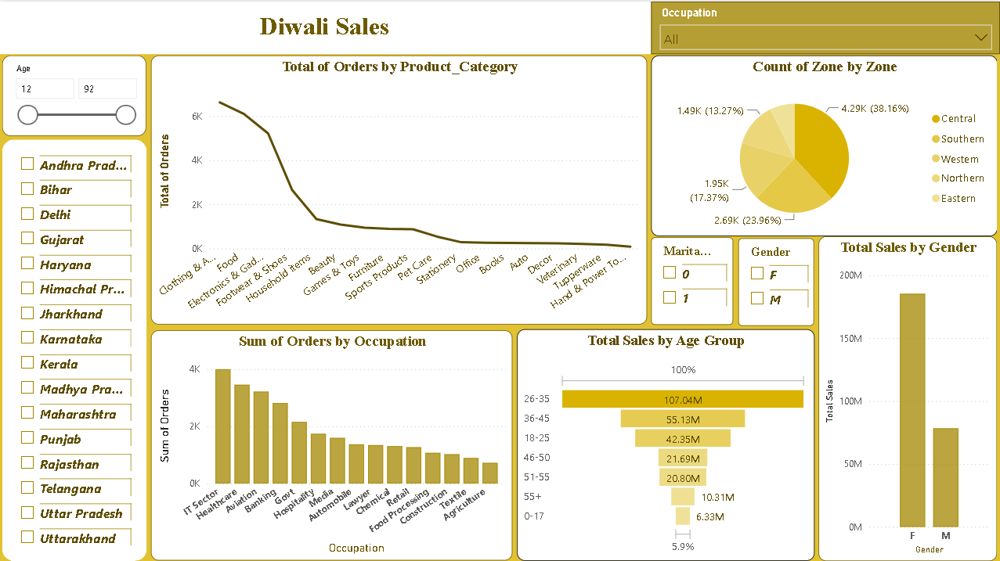

# 🪔 Diwali Sales Dashboard – Power BI

## 📌 Project Overview

This project presents an interactive Diwali Sales Dashboard created using Microsoft Power BI. The dashboard helps analyze sales performance, customer behavior, product categories, and other important business insights.

## 🎯 Project Objective

The main objective of this project is to analyze Diwali sales data and create an interactive dashboard that provides meaningful insights into customer purchasing patterns and overall sales performance.

## 🛠️ Tools & Technologies

- Microsoft Power BI
- Power Query
- DAX
- Data Visualization

## 📊 Dashboard Highlights

- Total Sales and Orders analysis
- Sales by State
- Sales by Gender
- Sales by Age Group
- Sales by Occupation
- Sales by Product Category
- Top-selling Products
- Interactive filters and slicers

## 🖼️ Dashboard Preview

## 📂 Project Files

- `PowerBI/Diwali Sales.pbix` – Power BI Dashboard
- `Dataset/Diwali_Sales_Data.csv` – Dataset used for analysis
- `Screenshots/Diwali-sales_Dashboard.png` – Dashboard Preview

## 💡 Key Insights

The dashboard provides a clear overview of Diwali sales and helps identify customer segments, top-performing categories, high-sales regions, and purchasing trends.

## 👨‍💻 Author

**Darshan Bagthariya**
